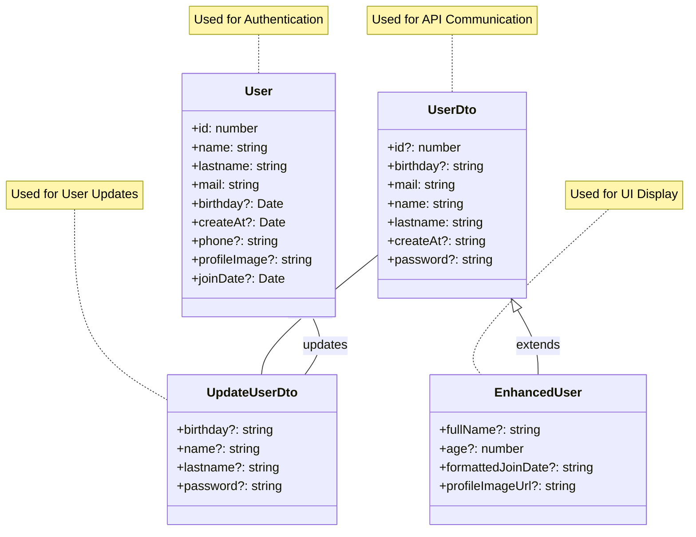

```mermaid
classDiagram
    class UserDto {
        +id?: number
        +birthday?: string
        +mail: string
        +name: string
        +lastname: string
        +createAt?: string
        +password?: string
    }
    class User {
        +id: number
        +name: string
        +lastname: string
        +mail: string
        +birthday?: Date
        +createAt?: Date
        +phone?: string
        +profileImage?: string
        +joinDate?: Date
    }
    class EnhancedUser {
        +fullName?: string
        +age?: number
        +formattedJoinDate?: string
        +profileImageUrl?: string
    }
    class UpdateUserDto {
        +birthday?: string
        +name?: string
        +lastname?: string
        +password?: string
    }

    UserDto <|-- EnhancedUser : extends
    UserDto -- UpdateUserDto : updates
    User -- UpdateUserDto : updates

    note for User "Used for Authentication"
    note for EnhancedUser "Used for UI Display"
    note for UserDto "Used for API Communication"
    note for UpdateUserDto "Used for User Updates"
```
